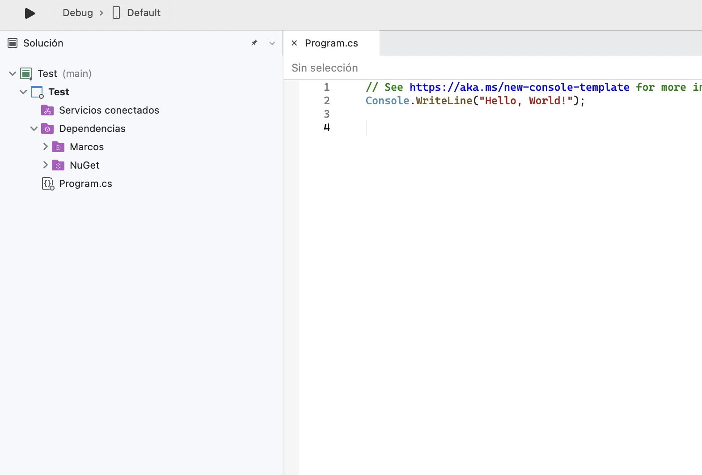
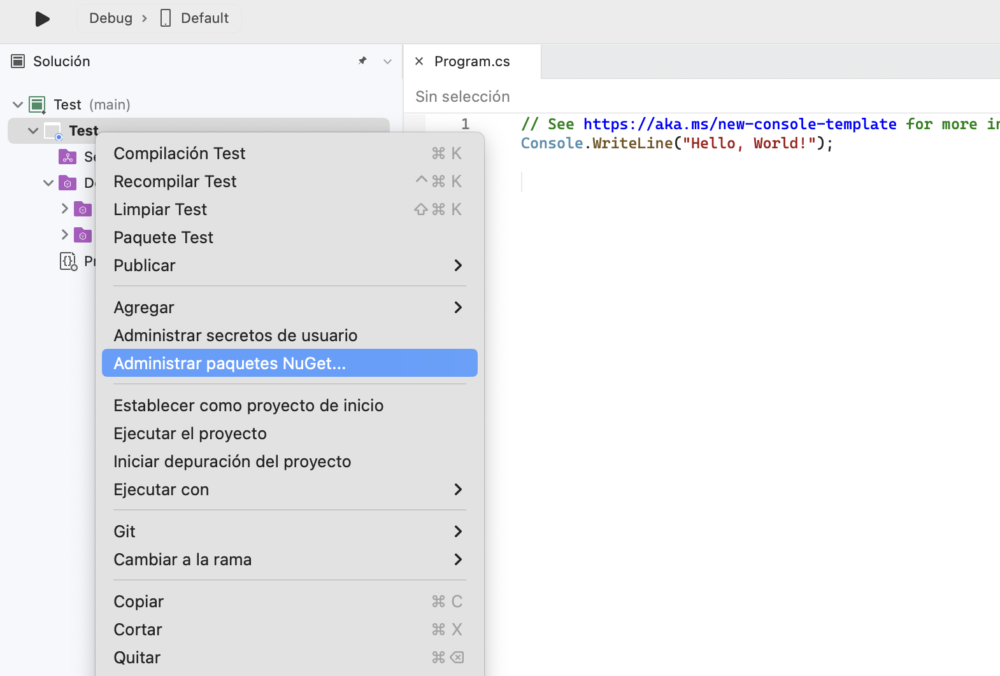
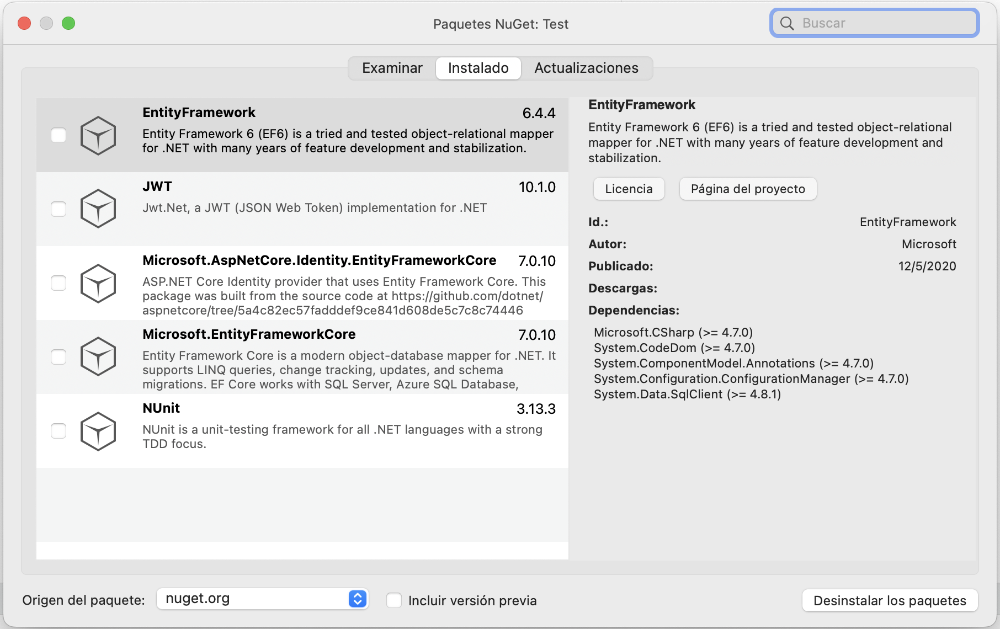

# NuGet

Tenemos el proyecto base

Le damos clic derecho y nos vamos a Administrar paquetes NuGet…

Se nos abrirá un modal donde podremos buscar y descargar nuestros paquetes, en este caso tenemos estos instalados

